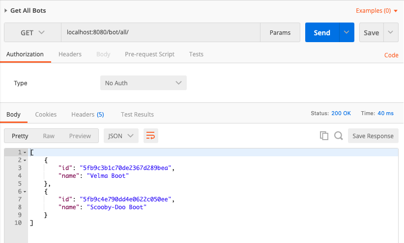
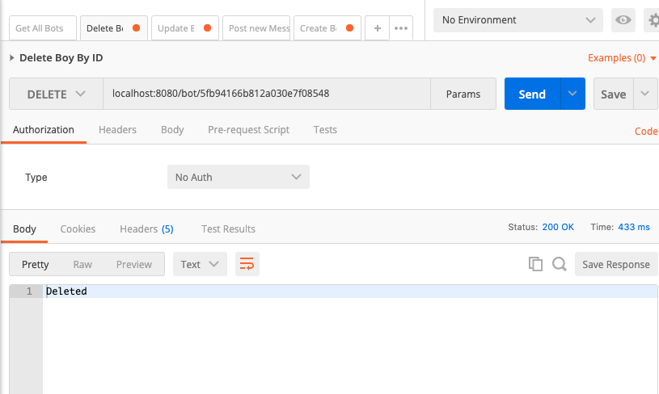

<h1>Chat Bot API</h1>
<h4>by: Gabriel Guimarães</h4>
<h5>Java, Spring Boot, MongoDB, Lombok</h5>
 

Endpoints:
 
<b>/BOT</b>
  <ul>
    <li>[GET]    /bot/all - retorna todos os bots criados </li>
    <li>[GET]    /bot/:id - busca bot por id </li>
    <li>[POST]   /bot/    - cria um novo bot</li>
    <li>[DELETE] /bot/:id - deleta o bot por id</li>
    <li>[PUT]    /bot/:id - altera o bot </li>
    </ul> 
    
   
<b>/MESSAGE</b>

 <ul>
    <li>[POST] /message - criar nova mensagem</li>
    <li>[GET]  /message/:id - busca mensagem por id</li>
    <li>[GET]  /message/conversation/:id - busca mensagens de uma determinada conversa</li>
    </ul> 

<h1>All Bots</h1>

 

<h1>Create Bot</h1>

<h1>Delete Bot</h1>

