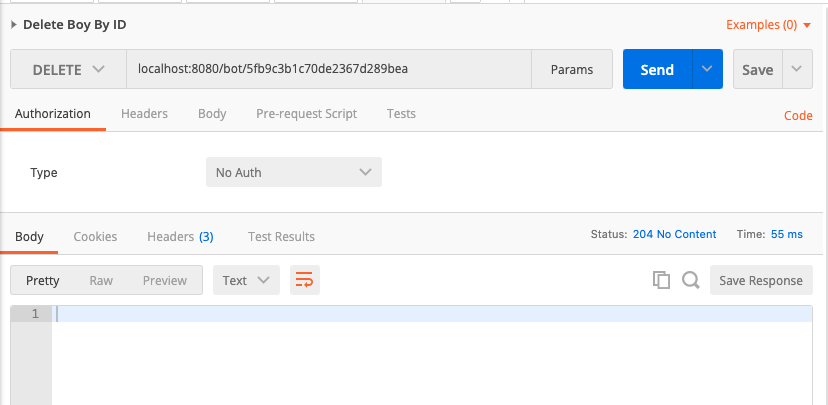
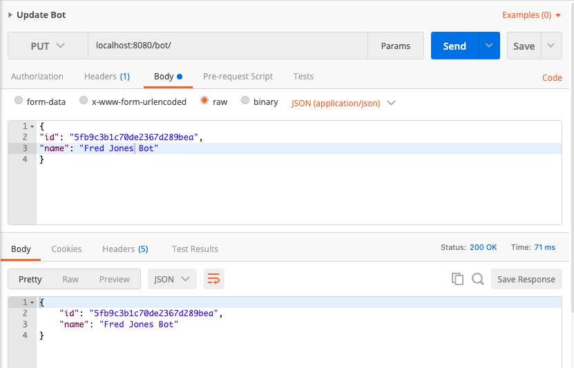

<h1>Chat Bot API</h1>
<h4>by: Gabriel Guimarães</h4>
<h3>Java, Spring Boot, MongoDB, Lombok</h3>

Projeto originalmente criado no GitHub <a href="https://github.com/johnwick182/chat-bot-api">https://github.com/johnwick182/chat-bot-api</a> e exportado para o GitLab

 
<h4>Como executar:</h4>

1. Baixar o projeto

2. Iniciar o mongoDB na porta 27017

3. Executar o comando no terminal <b>mvn spring-boot:run</b> na raiz do projeto

 
<h4>Observação</h4>

Database e collections serão criadas automaticamente pela API

Colletion com endpoints e exemplos disponível em /colletions

Criei a API com Java (Spring Boot) e MongoDB. Criei duas colletions, Bot e Message para armazenar os dados.

Criei todas as operações sugeridas e também uma adicional para listar todos os bots

Os ids são criados automaticamente pelo MongoDB e retornados nas chamadas da API

Os id da conversa, from e to devem ser passados pelo client.

 
 

Endpoints:
 
<b>/BOT</b>
  <ul>
    <li>[GET]    /bot/all - lista todos os bots criados </li>
    <li>[GET]    /bot/:id - busca bot por id </li>
    <li>[POST]   /bot/    - cria um novo bot</li>
    <li>[DELETE] /bot/:id - deleta o bot por id</li>
    <li>[PUT]    /bot/:id - altera o bot </li>
    </ul> 
    
   
<b>/MESSAGE</b>

 <ul>
    <li>[POST] /message - criar nova mensagem</li>
    <li>[GET]  /message/:id - busca mensagem por id</li>
    <li>[GET]  /message/conversation/:id - busca mensagens de uma determinada conversa</li>
    </ul> 

<h1>Testes Postman</h1>

<h1>List All Bots</h1>

 
<h1>Get Bot By Id</h1>

 
<h1>Create Bot</h1>

 
<h1>Delete Bot</h1>

 
<h1>Update Bot</h1>

<h1>Create New Message</h1>

<h1>Get Message By Conversation</h1>

<h1>Get Message By Id</h1>

<h1>Testes de Performance</h1>
<h4>Realizados em: Macbook Air - 8gb RAM - i5</h4>
<h3>Teste l</h3>

<h3>Teste ll</h3>

 Débitos e melhorias:

<ul>
<li>Criar testes unitários</li>
<li>Implementar camada de análise de mensagens e respostas do Bot (avaliar solução: DialogFlow)</li>
<li>Implementar JWT Token</li>
</ul>
